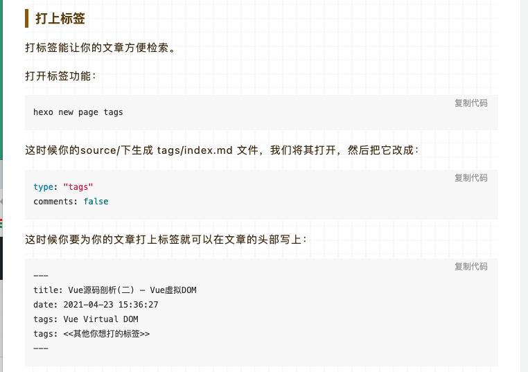
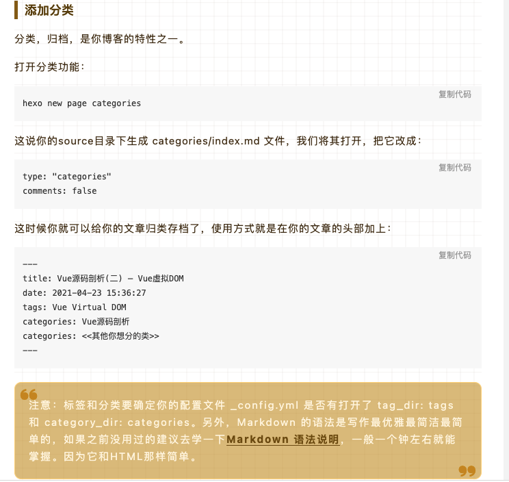

### camille Hugo blog 组成部分

1. hugo-theme-keep-forblog, keep theme,修改过后的主题。
2. hexo-blog-sourcecode，现在这个所有的源码，每次添加文件在这里加。
3. camillechang.github.io，用来 host 我的静态网站

# hexo-blog-sourcecode

- 当前的目录内设置了- GitHub Actions，具体见.github/workflows/hexo-deploy.yml
- GitHub Actions 当私有仓库的 hexo-blog-sourcecode master 有内容 push 进来时（例如：主题文件，文章 md 文件、图片等），
  会触发 GitHub Actions 自动编译并部署到公共仓库 camillechang.github.io 的 master 分支。
- 最后需要手动在 Custom domain，添加一下 domain name,过一会就能用了。暂时还没有想到其他解决办法。

# Note:

最后需要手动在 Custom domain，添加一下 domain name,过一会就能用了。暂时还没有想到其他解决办法。

# 主要命令为

hexo new hello （这里的 article 写上你的文章的名称）
你的 source/\_posts 下就会生成一个 hello.md 文件，在这个文件下就可以写上你的博客内容了。用 Markdown 的语法去写。
打开标签功能：

# 参考文章

https://sanonz.github.io/2020/deploy-a-hexo-blog-from-github-actions/
https://juejin.cn/post/6954942216808693773
