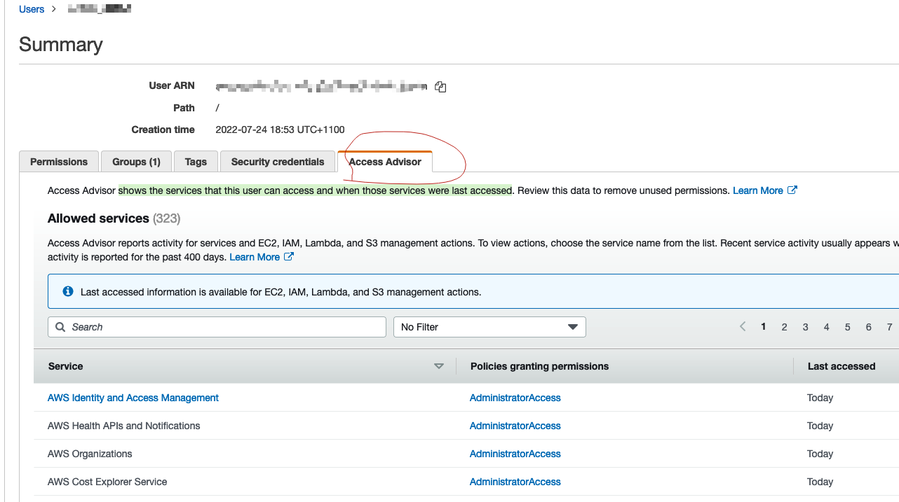

## English Version

### Exam Areas

1. Incident Response -12%

- Trusted Advisor, CloudFormation, Service Catalog, VPC Flow Logs, AWS Config, API gateway, CloudTrail, CloudWatch.

2. Logging and Monitoring - 20%

- CloudWatch, Config, CloudTrail， Inspector， Kinesis.

3. Infrastructure Security -26%

- Route53, WAF, CloudFront, Shield,

4. IAM -20%
5. Data Protection -22%

### S3

- Glacier vault lock, vault lock policy, WORM(write once, read many times). Once locked, the policy can no longer be changed.
- VPC gateway endpoint-> DynamoDB and S3
- VPC interface endpoint -> other aws services.
- Object ACLs, give grants to bucket owner, grant access to individual objects.
- Bucket ACLS, grant log delivery group write permission to bucket.
- Bucket policies, offer larger permissions than bucket ACLs.
- S3 server-side encryption is used to protect data at rest.
- Server access logging, provides detailed records for the requests that are made to a bucket
- If bucket version is enabled, each object version should have a different encryption key.
- s3 bucket can set **aws:referer** key to get request originate from specific webpages.

### interface endpoint vs gateway endpoint

- An interface endpoint is powered by PrivateLink, and uses an elastic network interface (ENI) as an entry point for traffic destined to the service.
- A gateway endpoint serves as a target for a route in your route table for traffic destined for the service, only for s3 and DynamoDB.

### CloudFront

- Access logs for source IP address, the original request, the referrer, and protocol information.

### ACM

- There is no ACM private CA policy, can use IAM polices(users,groups,roles) to control access.
- ACM is regional service, for redundancy you need to create multiple CAs.(Not matter private CA or public CA)
- AssumeRoleWithWebIdentity, STS temporary security credentials returned by this API consist of an access key ID, a secret access key, and a security token.

### ALB

- Supports multiple TLS certificates via (server name indication)SNI.

### STS

- Federation(typically Active Directory)
  - SAML
  - SSO allows users to log in without IAM credentials
- Federation with Mobile Apps
  - Facebook/Amazon/Google or other OpenID providers to log in.
  - No need to store AWS credentials locally
  - Provide temporary credentials map to an IAM role
- Cross Account Access
- GetFederationToken returns a set of temporary security credentials (consisting of an access key ID, a secret access key, and a security token) for a federated user.

### Cognito

- Used for authenticating to web and mobile applications and is not related to Microsoft AD.
- User Pools, user directories, creating users or federating to social IdPs
- Identity Pools, support **anonymous** guest users or unauthenticated access.

### Identity providers and federation

- Use IAM OpenID Connect(OIDC) When establish trust between an OIDC-compatible IdP and AWS account but cannot manage users. For mobile app or web app.
- Use IAM identity provider when establish trust between SAML-compatible IdP(ADFS and aws), that users in your org can access aws.

### IAM

- trust policy, a required resource-based policy that is attached to a role in IAM. The principles that you can specify in the trust policy include users, roles, accounts, and services.
- IAM Access Analyzer, helps you identify the resources in your organization and accounts, such as Amazon S3 buckets or IAM roles, **shared with an external entity**. This lets you identify unintended access to your resources and data.
- IAM Access advisor, shows the services that this user can access and when those services were last accessed
  
- IAM credential report, list all users and the status of their various credentials, passwords, access keys, MFA.
  

### AWS Resource Access Manager

- sharing your AWS resources with other accounts

## Logging and Monitoring

### Cloudtrail

- log file integrity, delivered with a digest file.
- does not use an IAM Role it uses the service principal `“cloudtrail.amazonaws.com"`.
- Event history,-90days

### Cloud config

- detect resources changes, not compromised access, not usage.
- Auto Remediation feature automatically remediates non-compliant resources evaluated by AWS Config rules.
- Provides a detailed list of resources defined in your aws account.
- Can add custom rules using Lambda functions.
- Trigger frequency is 1,3,6,12,24 hours.

### CloudHSM

- single tenancy, secure key store, cryptographic operations, tamper-resistant hardware security module
- should be used if you need hardware based HSMs within a VPC.
- CloudHSM cluster, can inlude many HSM instances in different AZs.

### AWS inspector

- CIS benchmarks/ certified rules, automated security, vulnerabilities assessment service
- tests the network accessibility of your **EC2** instances and the security state of your applications that run on those instances.

### Trust advisor

- provides recommendations that help you follow AWS best practices. Trusted Advisor evaluates your account by using checks. These checks identify ways to optimize your AWS infrastructure, improve security and performance, reduce costs, and monitor service quotas.
- can provide information on security groups for any sort of unrestricted access.

## Infrastructure security

### KMS

- key deletion time min 7 days
- KMS keys can only encrypt data up to 4 KB in size and for anything larger you need to create data encryption keys.
- Key rotation:
  - **AWS managed KMS, YOU CAN DO Nothing, even add key**, automatically rotates every year.
  - Customer Managed KMS, automatic rotation every 365 days(**disabled by default**), can rotate manually; create new CMK or change Key Alias to new CMK.
  - Customer managed + imported key material, no automatic rotation, create new CMK or change Key Alias to new CMK.
- change expiration date of a KMS key,=> reimport same key material and specify a new expiration date.
- **Kms:ViaService**, used for ec2/RDS from Us-west region
- **custom key store** is backed by AWS CloudHSM and imposes certain limitations. For example you **cannot import your own key material** into KMS keys or enable automatic rotation
- **cryptographic erasure**, is when the encryption material used to encrypt the data is deleted. ensure that the key materials are backed up offline(**import key material into an AWS KMS ke**y) so you can perform a restore of the data.

### System manager

- Patch Manager can be used to scan systems, report compliance, identify vulnerable versions of software, and then install patches on the systems.
- systems Manager automation can be configured for automatic remediation if the rule returns a non-compliant state.
- systems Manager Compliance is used to scan instances for patch compliance and configuration inconsistencies. It is not used to monitor access policies of S3 buckets.
- Run command, allows you to automate common administrative tasks and perform one-time configuration changes at scale, eg reset passwords(AWSSupport-RunEC2RescueForWindowsTool).
- EC2Rescue, a troubleshooting tool that you can run on your Amazon EC2 Windows Server instances. collect memory dumps from EC2 instances that are unresponsive using the EC2Rescue CLI with the /offline mode and the device ID specified.

### Macie

- machine learning to discover, classify and protect **PII** in **S3/cloudtrail**
- Includes Dashboards, reports and alerting

### GuardDuty

- **threat detection service** provides an accurate and easy way to continuously monitor and protect AWS accounts and workloads.
- can detect attacks such as application-level attacks. However, to offer the protection you would need to integrate with other services such as CloudWatch Events and Lambda to respond to incidents.
- **Findings**, **Malicious and unauthorized behaviour**（resource affected, action ), such as port scans.

### QuickSight

- For Visualization, and only supports text file formats(.csv,.tsv .clf or .elf) stored in S3.

### QuickSigh

### Security Hub

- central hub for security alerts
- automated checks
  - PCI-DSS(payment card industry)
  - CIS(center for internet security)
- Integration(guardduty, macie, inspector， firewall manager)

### Artifact

- central resource for compliance and security-related information
- ISO, PCI, SOC reports, validate compliance of underlying aws infrastructure.

### DDos mitigation on AWS

- ELB, CloudWatch, ASG, Shield, Route53, WAF and CloudFront.

### CloudWatch

- Unified CloudWatch Agent sends system-level(memory and disk usage) metrics for EC2 and on- premises servers.

### AWS signer

- only trusted code runs in your Lambda functions, create digitally signed packages for Lambda deployment.

### VPC

- Flow Logs, can be used to capture IP traffic.
- VPC **Traffic Mirroring,** use to copy network traffic from an elastic network interface of Amazon EC2 instances. You can then send the traffic to out-of-band security and monitoring appliances for: Content inspection, Threat monitoring and Troubleshooting
- All traffic sent to EC2 instances can be captured for inspection with an intrusion detection appliance by configuring VPC traffic mirroring with a network load balancer.
- Each EC2 instance performs **source/destination checks** by default. This means that the instance must be the source or destination of any traffic it sends or receives. However, an inline security appliance/a NAT instance must be able to send and receive traffic when the source or destination is not itself.
- The public keys are in the **.ssh/authorized_keys** file on the instance. To replace the key pair, generate a new key pair using the EC2 console and then paste the public key information into the **authorized_keys file**. The original key information should also be deleted.

### Organization trails

- **log events for the management account and all member accounts in the organization.**
- When you create an organization trail, a trail with the name that you give it will be created in every AWS account that belongs to your organization. Users with CloudTrail permissions in member accounts will be able to see this trail when they log into the AWS CloudTrail console from their AWS accounts, or when they run AWS CLI commands such as describe-trail.
- However, users in member accounts will not have sufficient permissions to delete the organization trail, turn logging on or off, change what types of events are logged

### Amazon Detective

- automatically collects log data from your AWS resources. It then uses machine learning, statistical analysis, and graph theory to generate visualizations that help you to conduct faster and more efficient security investigations.
- When you try to enable Detective, Detective checks whether GuardDuty has been enabled for your account for at least 48 hours. If you are not a GuardDuty customer or have been a GuardDuty customer for less than 48 hours, you cannot enable Detective. You must either enable GuardDuty or wait for 48 hours. This allows GuardDuty to assess the data volume that your account produces.

### OpenSearch

- successor to Elasticsearch and is a distributed, open-source search and analytics suite used for a broad set of use cases like real-time application monitoring, log analytics, and website search.
- receive data from Kinesis and can then analyze and store the data.

### _Secrets Manager vs Parameter Store_

- For Secrets Manager, PCI compliant where the mandate is to rotate your passwords every 90days. Only works for select databases and does not work for SSH keys
- For Parameter Store, a cheaper option to store encrypted or unencrypted secrets, does not automatically rotate credentials

### AWS Audit Manager

- map your compliance requirements to AWS usage data with prebuilt and custom frameworks and automated evidence collection.

### AWS Firewall Manager

- Works with WAF, Network Firewall, Shield, Route53 Resolver DNS Firewall.
- network access control list (NACLs) is an optional layer of security for your **VPC or subnet level** that acts as a firewall for controlling traffic in and out of one or more subnets, while sg for instances.

### Network Firewall

- intrusion detection and prevention service for your virtual private cloud (VPC)
- can filter traffic

### Kinesis

- Log ingestion
  - Kinesis data streams
    - Basic(stream-level), automatically per minute no charge
    - Enhanced(shared-level), per minute with extra cost.
    - Producer(DescribeStream, PutRecord) and Consumer(GetStream, GetRecords)
  - Kinesis Data firehose
- Log analysis
  - Kinesis data analytics

### AWS Directory Service

- **AWS Managed Microsoft AD** - AWS Cloud, for up to 5000 employees and directory objects.
- **AD Connector** - On-premises users need to access AWS services via AD.
- **Simple AD** - Low-scale, low-cost basic Active Directory capability.

### Others

- Direct Connect + Virtual private gateway(VGW)=encryption in transit( IPsec-encrypted private connection)
- Kinesis Data Streams uses TLS for all connections, so the data is encrypted in transit by default.
- **Forward Secrecy (FS)** uses a derived session key to provide additional safeguards against the eavesdropping of encrypted data. This prevents the decoding of captured data, even if the secret long-term key is compromised. **ALB does not support custom security policies.**

- Envelope encryption, encrypt plaintext data with a data key, and then encrypting the data key under another key.
- Key pairs consist of a public key and a private key. Private key to create digital signature, public to validate signature. Key pairs can be used to SSH to aws EC2 instances.
- AppSync enables subscriptions to synchronize data across devices.
- A Lambda function can be cofigured to connect to DynamoDB using private IPs by cofiguring the function in a VPC and using a VPC endpoint for the DynamoDB table.
- All data flowing across AWS Regions over the AWS global network is automatically encrypted at the physical layer before it leaves AWS secured facilities. All traffic between AZs is also encrypted.
- organization trail, you can create a trail that logs all events for all AWS accounts in that organization
- Lambda authorizer, uses a bearer token authentication strategy such as OAuth or SAML, or that uses request parameters to determine the caller's identity. When a client makes a request to one of your API's methods, API Gateway calls your Lambda authorizer, which takes the caller's identity as input and returns an IAM policy as output.

Refer: https://learn.acloud.guru/course/aws-certified-security-specialty/dashboard

- https://docs.aws.amazon.com/apigateway/latest/developerguide/apigateway-use-lambda-authorizer.html

---

## 中文版

### 考试领域

1. Incident Response——12%

- Trusted Advisor、CloudFormation、Service Catalog、VPC Flow Logs、AWS Config、API Gateway、CloudTrail、CloudWatch

2. Logging and Monitoring——20%

- CloudWatch、Config、CloudTrail、Inspector、Kinesis

3. Infrastructure Security——26%

- Route 53、WAF、CloudFront、Shield

4. IAM——20%
5. Data Protection——22%

### S3

- Glacier Vault Lock、Vault Lock 策略、WORM（write once, read many times）。锁定后，策略无法再更改
- VPC Gateway Endpoint → DynamoDB 和 S3
- VPC Interface Endpoint → 其他 AWS 服务
- Object ACL：向存储桶所有者授予权限，以及授予对单个对象的访问权限
- Bucket ACL：向日志传递组授予对存储桶的写入权限
- Bucket Policy：提供比 Bucket ACL 更广泛的权限
- S3 服务器端加密用于保护静态数据
- Server Access Logging 为对存储桶发出的请求提供详细记录
- 如果启用了存储桶版本控制，每个对象版本都应使用不同的加密密钥
- S3 存储桶可以设置 **aws:referer** 键，以接受来自特定网页的请求

### Interface Endpoint 与 Gateway Endpoint

- Interface Endpoint 由 PrivateLink 提供支持，并使用 Elastic Network Interface（ENI）作为发往服务的流量入口
- Gateway Endpoint 作为路由表中发往服务的流量目标，仅适用于 S3 和 DynamoDB

### CloudFront

- Access Logs 包含源 IP 地址、原始请求、Referrer 和协议信息

### ACM

- 不存在 ACM Private CA 策略；可以使用 IAM 策略（用户、组、角色）控制访问
- ACM 是区域性服务；为了实现冗余，需要创建多个 CA（无论是 Private CA 还是 Public CA）
- AssumeRoleWithWebIdentity：该 API 返回的 STS 临时安全凭证由 Access Key ID、Secret Access Key 和 Security Token 组成

### ALB

- 通过 SNI（Server Name Indication）支持多个 TLS 证书

### STS

- 联合身份验证（通常使用 Active Directory）
  - SAML
  - SSO 允许用户在没有 IAM 凭证的情况下登录
- 与移动应用联合
  - 使用 Facebook/Amazon/Google 或其他 OpenID Provider 登录
  - 无需在本地存储 AWS 凭证
  - 提供映射到 IAM Role 的临时凭证
- 跨账户访问
- GetFederationToken 为联合用户返回一组临时安全凭证（包括 Access Key ID、Secret Access Key 和 Security Token）

### Cognito

- 用于 Web 和移动应用身份验证，与 Microsoft AD 无关
- User Pools：用户目录，用于创建用户或与社交 IdP 联合
- Identity Pools：支持**匿名**访客用户或未经身份验证的访问

### Identity Provider 与联合

- 当需要在兼容 OIDC 的 IdP 与 AWS 账户之间建立信任但不能管理用户时，使用 IAM OpenID Connect（OIDC）；适用于移动或 Web 应用
- 当需要在兼容 SAML 的 IdP（ADFS 与 AWS）之间建立信任，让组织内用户访问 AWS 时，使用 IAM Identity Provider

### IAM

- Trust Policy：附加到 IAM Role 的必需基于资源的策略。可指定的 Principal 包括用户、角色、账户和服务
- IAM Access Analyzer：帮助识别组织和账户中与**外部实体共享**的资源，例如 Amazon S3 存储桶或 IAM Role，从而发现对资源和数据的意外访问
- IAM Access Advisor：显示该用户可访问的服务以及上次访问这些服务的时间
  
- IAM Credential Report：列出所有用户及其各类凭证的状态，包括密码、Access Key 和 MFA
  

### AWS Resource Access Manager

- 与其他账户共享 AWS 资源

## 日志记录与监控

### CloudTrail

- Log File Integrity：与 Digest File 一起传递
- 不使用 IAM Role，而是使用 Service Principal `“cloudtrail.amazonaws.com"`
- Event History：90 天

### AWS Config

- 检测资源变更，而不是访问泄露或使用情况
- Auto Remediation 自动修复 AWS Config Rule 评估出的不合规资源
- 提供 AWS 账户中已定义资源的详细列表
- 可使用 Lambda Function 添加自定义规则
- 触发频率为 1、3、6、12、24 小时

### CloudHSM

- 单租户、安全密钥存储、加密操作、防篡改硬件安全模块
- 如果需要 VPC 内基于硬件的 HSM，应使用 CloudHSM
- CloudHSM 集群可包含分布在不同 AZ 的多个 HSM 实例

### AWS Inspector

- CIS Benchmark/认证规则、自动化安全和漏洞评估服务
- 测试 **EC2** 实例的网络可访问性，以及这些实例上运行的应用程序的安全状态

### Trusted Advisor

- 提供有助于遵循 AWS 最佳实践的建议。Trusted Advisor 使用检查来评估账户，从而找出优化 AWS 基础设施、提高安全性和性能、降低成本以及监控 Service Quota 的方法
- 可提供有关 Security Group 中各种不受限制访问的信息

## 基础设施安全

### KMS

- 密钥删除的最短等待时间为 7 天
- KMS Key 最多只能加密 4 KB 数据；更大的数据需要创建 Data Encryption Key
- 密钥轮换：
  - **AWS Managed KMS：你无法进行任何操作，甚至不能添加密钥**；每年自动轮换
  - Customer Managed KMS：每 365 天自动轮换一次（**默认禁用**）；也可手动轮换，即创建新 CMK 或将 Key Alias 改指向新 CMK
  - Customer Managed + Imported Key Material：不支持自动轮换；创建新 CMK 或将 Key Alias 改指向新 CMK
- 更改 KMS Key 的到期日期：重新导入相同的 Key Material，并指定新的到期日期
- **Kms:ViaService**：用于来自 us-west 区域的 EC2/RDS
- **Custom Key Store** 由 AWS CloudHSM 支持，并有一些限制。例如，不能将自己的 Key Material 导入 KMS Key，也不能启用自动轮换
- **Cryptographic Erasure** 指删除用于加密数据的加密材料。确保 Key Material 已离线备份（**将 Key Material 导入 AWS KMS Key**），以便恢复数据

### Systems Manager

- Patch Manager 可扫描系统、报告合规性、识别存在漏洞的软件版本，然后在系统上安装补丁
- Systems Manager Automation 可配置为在规则返回不合规状态时自动修复
- Systems Manager Compliance 用于扫描实例的补丁合规性和配置不一致；不用于监控 S3 存储桶的访问策略
- Run Command 可自动执行常见管理任务，并大规模执行一次性配置更改，例如重置密码（AWSSupport-RunEC2RescueForWindowsTool）
- EC2Rescue 是可在 Amazon EC2 Windows Server 实例上运行的故障排除工具。可以使用 EC2Rescue CLI 的 `/offline` 模式并指定 Device ID，从无响应的 EC2 实例收集 Memory Dump

### Macie

- 使用机器学习发现、分类和保护 **S3/CloudTrail** 中的 **PII**
- 包含 Dashboard、报告和警报

### GuardDuty

- **Threat Detection Service**，提供准确、简便的方式来持续监控和保护 AWS 账户及工作负载
- 可以检测应用层攻击等攻击；但要提供防护，需要与 CloudWatch Events 和 Lambda 等其他服务集成以响应事件
- **Findings**：**恶意和未经授权的行为**（受影响资源、操作），例如端口扫描

### QuickSight

- 用于可视化，仅支持存储在 S3 中的文本文件格式（.csv、.tsv、.clf 或 .elf）

### QuickSigh

### Security Hub

- 安全警报的中央枢纽
- 自动检查：
  - PCI-DSS（Payment Card Industry）
  - CIS（Center for Internet Security）
- 集成（GuardDuty、Macie、Inspector、Firewall Manager）

### Artifact

- 合规与安全相关信息的中央资源
- ISO、PCI、SOC 报告；验证底层 AWS 基础设施的合规性

### AWS 上的 DDoS 缓解

- ELB、CloudWatch、ASG、Shield、Route 53、WAF 和 CloudFront

### CloudWatch

- Unified CloudWatch Agent 将 EC2 和本地服务器的系统级指标（内存和磁盘使用量）发送到 CloudWatch

### AWS Signer

- 确保 Lambda Function 中只运行受信任代码；为 Lambda 部署创建数字签名包

### VPC

- Flow Logs 可用于捕获 IP 流量
- VPC **Traffic Mirroring** 用于复制 Amazon EC2 实例的 Elastic Network Interface 流量，然后可将流量发送到带外安全和监控设备，用于内容检查、威胁监控和故障排除
- 通过为 Network Load Balancer 配置 VPC Traffic Mirroring，可以捕获发送到 EC2 实例的所有流量，并使用入侵检测设备检查
- 每个 EC2 实例默认执行 **Source/Destination Check**，即实例必须是其发送或接收流量的源或目标。但内联安全设备/NAT Instance 必须能在自身不是源或目标时发送和接收流量
- 公钥位于实例的 **.ssh/authorized_keys** 文件中。若要替换 Key Pair，请使用 EC2 控制台生成新 Key Pair，然后将公钥信息粘贴到 **authorized_keys 文件**中；还应删除原始密钥信息

### Organization Trail

- **记录组织中 Management Account 和所有 Member Account 的事件**
- 创建 Organization Trail 时，每个属于该组织的 AWS 账户中都会创建一个同名 Trail。Member Account 中拥有 CloudTrail 权限的用户登录其账户的 AWS CloudTrail 控制台，或运行 describe-trail 等 AWS CLI 命令时，可以看到该 Trail
- 但是，Member Account 中的用户没有足够权限删除 Organization Trail、开启或关闭日志记录，或更改所记录的事件类型

### Amazon Detective

- 自动收集 AWS 资源的日志数据，然后使用机器学习、统计分析和图论生成可视化，帮助更快、更高效地开展安全调查
- 启用 Detective 时，它会检查账户是否已启用 GuardDuty 至少 48 小时。如果你不是 GuardDuty 客户，或使用时间不足 48 小时，则无法启用 Detective；必须启用 GuardDuty 或等待 48 小时，以便 GuardDuty 评估账户产生的数据量

### OpenSearch

- Elasticsearch 的后继者，是分布式开源搜索和分析套件，适用于实时应用监控、日志分析和网站搜索等广泛场景
- 可从 Kinesis 接收数据，然后分析并存储这些数据

### _Secrets Manager 与 Parameter Store_

- Secrets Manager：符合 PCI 要求，可满足每 90 天轮换密码的规定；仅适用于选定数据库，不适用于 SSH Key
- Parameter Store：用于存储加密或未加密 Secret 的更便宜方案，不会自动轮换凭证

### AWS Audit Manager

- 使用预构建和自定义 Framework 以及自动证据收集，将合规要求映射到 AWS 使用数据

### AWS Firewall Manager

- 与 WAF、Network Firewall、Shield、Route 53 Resolver DNS Firewall 配合使用
- Network Access Control List（NACL）是 **VPC 或子网级别**的可选安全层，充当防火墙以控制一个或多个子网的入站和出站流量；SG 则用于实例

### Network Firewall

- 用于 Virtual Private Cloud（VPC）的入侵检测与防御服务
- 可以筛选流量

### Kinesis

- 日志摄取
  - Kinesis Data Streams
    - Basic（Stream 级别）：每分钟自动收集，不收费
    - Enhanced（Shard 级别）：每分钟收集，额外收费
    - Producer（DescribeStream、PutRecord）和 Consumer（GetStream、GetRecords）
  - Kinesis Data Firehose
- 日志分析
  - Kinesis Data Analytics

### AWS Directory Service

- **AWS Managed Microsoft AD**——位于 AWS Cloud，最多支持 5000 名员工和目录对象
- **AD Connector**——本地用户需要通过 AD 访问 AWS 服务
- **Simple AD**——小规模、低成本的基础 Active Directory 功能

### 其他

- Direct Connect + Virtual Private Gateway（VGW）= 传输中加密（采用 IPsec 加密的私有连接）
- Kinesis Data Streams 对所有连接使用 TLS，因此默认对传输中的数据加密
- **Forward Secrecy（FS）** 使用派生 Session Key，为防止加密数据被窃听提供额外保障。即使长期 Secret Key 泄露，也无法解码已捕获的数据。**ALB 不支持自定义安全策略**
- Envelope Encryption：使用 Data Key 加密明文数据，再用另一个密钥加密该 Data Key
- Key Pair 由 Public Key 和 Private Key 组成。Private Key 用于创建数字签名，Public Key 用于验证签名。Key Pair 可用于通过 SSH 连接 AWS EC2 实例
- AppSync 支持使用订阅在设备之间同步数据
- 可通过将 Lambda Function 配置到 VPC 中，并为 DynamoDB Table 使用 VPC Endpoint，使其通过私有 IP 连接 DynamoDB
- AWS 区域之间经 AWS Global Network 传输的所有数据，在离开 AWS 安全设施前都会在物理层自动加密；AZ 之间的所有流量也会加密
- Organization Trail 可记录组织内所有 AWS 账户的全部事件
- Lambda Authorizer 使用 OAuth 或 SAML 等 Bearer Token 身份验证策略，或使用请求参数确定调用者身份。当客户端请求 API 的某个方法时，API Gateway 调用 Lambda Authorizer；后者以调用者身份作为输入，并返回 IAM Policy 作为输出

参考：https://learn.acloud.guru/course/aws-certified-security-specialty/dashboard

- https://docs.aws.amazon.com/apigateway/latest/developerguide/apigateway-use-lambda-authorizer.html
