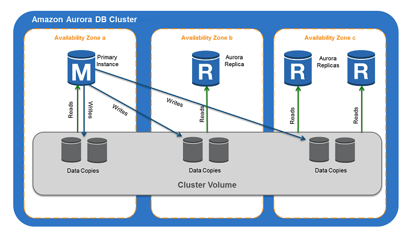
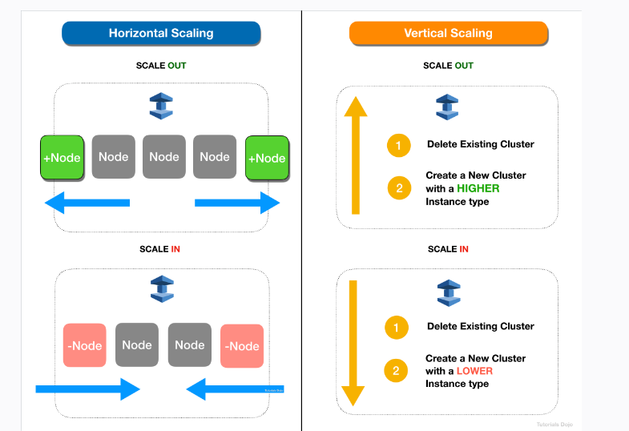
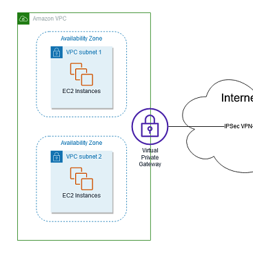

### Route53

1. A record - root domain, forward domain/sub domain to IPv4 address
2. Alias - route traffic to AWS resources, such as CloudFront, S3.
3. CNAME - map one domain to another, but not root domaian.
4. AAAA - IPv6

### CloudFormation

- StackSets - can deploy to multiple accounts/regions with single operation
- Changeset - upcoming changes
- Nested stacks - reuse

### encryption
- SSE-S3, s3 managed keys + AES 256
- SSE-KMS, key can be customer generated and KMS mannaged
- SSE-C, server side encryption + client manage keys + key does not store on AWS
- Client side encryption

### Volume and Storage
- Volume gateway
		1. Stored volumes, asynchronise copy ->s3, full volume to local gateway
		2. Cached Volumes, full volume ->s3, part volume to local cache.
- SSD
		1. General purpose, gp3, gp2
		2. Provisioned IOPS, io2(block express), io1
- HDD(cannot use as boot volume and multi attach)
		1. Throughout optimized, st1
		2. Cold HDD, sc1
- RDS
		1. Enhaced monitoring, metrics, cpu, memory, cheaper visibilty
		2. Proxy pool share DB connections, improve performace.
		3. Multi-AZ, high avaiblity.
- S3
		1. RTC(Replication time control), event notification <15mins
		2. WORM, valut lock policy
		3. Inventory report, audit/report replicaiton/encryption status of objects.
		vs System manager inventory, collect metadata from EC2 and on prem.
		4. Transfer Acceleration is a bucket-level feature that enables fast, easy, and secure transfers of files over long distances between your client and an S3 bucket.
		5. Global Accelerator service does not work with S3. It only supports endpoints like application load balancers, network load balancers, EC2 instances, or elastic IP addresses.
- Data Lifecycle Manager
		1. automate the creation, retention, and deletion of Amazon Elastic Block Store (Amazon EBS) snapshots.
		2. create a lifecycle policy that includes specific tags to back up EBS volumes on a specified schedule and for a specified retention period.
- Aurora DB cluster,
		- consists of one or more DB instances and a cluster volume that manages the data for those DB instances
		-  cluster volume is a virtual database storage volume that spans multiple Availability Zones, with each Availability Zone having a copy of the DB cluster data.
	
		Link https://docs.aws.amazon.com/AmazonRDS/latest/AuroraUserGuide/Aurora.Overview.html
		- backtracking an Aurora DB cluster,"rewinds" the DB cluster to the time you specify
		- the Performance Insights feature in the Amazon Aurora Serverless database which will automatically connect to a new Aurora database instance while preserving application connections.
### AD
- AWS AD, windows, VPN/ dircect connect
- AD connector, trust relationship, AD->AWS
- Simple AD, LDAP

### AMI
- Linux paravitural AMI, are not supported in all AWS regions.
- Hareware VM(HVM)

### ElasticCache
- Redis, add shards, scales horizontally, support data types
	1. cluster mode enabled, means that your data and read/write access to that data is spread across multiple Redis nodes.

- Memcached, mutithread, add nodes, scaled vertically
  1. Scaling HORIZONTALLY:
		1.1. scale out (Add Nodes to a Cluster)
		1.2. scale in (Remove Nodes from a Cluster)
  2. Scaling VERTICALLY
		2.1  scale out (create a new cluster and using a higher EC2 type)
		2.1  scale in (create a new cluster and using a lower EC2 type)
	3. does not support Multi-AZ for high availability.
	
	From link https://portal.tutorialsdojo.com/courses/aws-certified-sysops-administrator-associate-practice-exams/
### Some security and other services
- WAF, SQL Injection/ Cross site scripting, filter web traffic based on IP addresses, HTTP body/headers, custom URIs
- OpsHubs, manage snow family, devices and local aws services
- Control tower,create accounts via account factory, enroll account, landing zone's managment accounts.
- Artifact, report of ISO certificates and PCI.
- cloudHSM, hardware security module, 3rd party support, generated encrtyption keys
- Config,
- Shield, DDOS
- Shield Advanced: DDOS protecting for scaling, layer3,4 and 7
- Inspector, automated vulnerability management service that continually scans workloads for software vulnerabilities and unintended network exposure.
- GuardDuty, Intelligent threat detection.
- Cloudtrail, who to blame, log API activity, data events and file intergrity validation.
- X-Ray, debug apps
- Macie, machine learning to discover, monitor and protect s3. API keys, regulatory documents.
- Glue, extract, transform, load (ETL) service, work with data lakes,redshift,RDS,crawer to populate glue catalog with tables.
- Trust Advisor, check service  usage>80%, real time guidance, cost
- AWS inventory, collect metedata from EC2 and on-prme

### VPC and Network
- Direct connect + VPN = IPSec-encrypted private connection
- Site to site VPN = on prem + amazon VPC

## Others never remembered
- Enhanced Networking, provides higher bandwidth, higher packet per second (PPS) performance, and consistently lower inter-instance latencies
- Virtual Private Gateway,VPN endpoint
 
- CloudFront Origin Shield, an additional layer in the CloudFront caching infrastructure that helps to minimize your origin’s load, improve its availability, and reduce its operating costs.缓存Better cache hit ratio,Better network performance and Reduced origin load.
- warm pool is a pool of pre-initialized EC2 instances that sits alongside an Auto Scaling group

## System mamanger
- Inventory, collects information about your instances and the software installed on them, helping you to understand your system configurations and installed applications.
- Automation, automate common and repetitive IT operations and management tasks
- Run Command, provides you safe, secure remote management of your instances at scale without logging into your servers, replacing the need for bastion hosts, SSH, or remote PowerShell

## Cloudfront
- Cache statistics,
- Popular objects, what objects are frequently being accessed, and get statistics on those objects.
- Top referrers
- Usage report, the number of HTTP and HTTPS requests that CloudFront responds to from edge locations in selected regions.
- Viewers, the physical devices (desktop computers, mobile devices) and about the viewers (typically web browsers)

## Little
- By default, the enableDnsHostNames is set to false for VPCs created using the AWS CLI
- AWS Resource Access Manager (RAM) helps you securely share your resources across AWS accounts
-