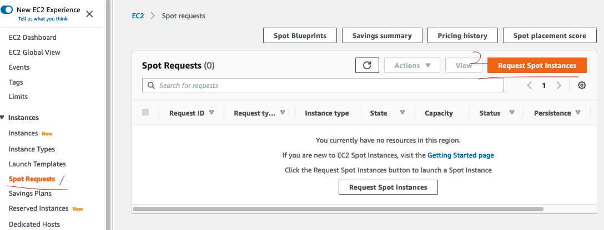

## English Version

I took all the exams at home, using different operating systems (macOS, Windows 10, and Windows 11).

### First Attempt — Software Problem

- On 23/07/2022, I used macOS. After the proctor told me that he had started my exam, he closed the chat window, but the exam did not launch successfully. I had to contact Pearson VUE and wait two days to receive a voucher for my next attempt.

### Second Attempt — Hands-on Lab Practice

- On 6/8/2022, I scored 681 without completing any labs, using macOS.
- The multiple-choice and multiple-response questions were simple, but I failed the three hands-on labs.
- The first reason was that I did not expect the labs to be difficult, so I did not prepare or practice them at all; I only practiced the other questions.
- The second reason was that some Udemy practice exams did not include labs, which made me think the labs would be easy.
- The lab questions included:
  > Updating a CloudFormation stack
  >
  > Creating Route 53 failover with a primary ALB and a secondary S3 static website
  >
  > Creating CloudWatch alarms and metric filters
- I had to enroll in another course that included labs, focus on hands-on practice again, and prepare for another attempt two or three weeks later.

### Third Attempt — Software Problem

- On 26/8/2022, I scored 654 without completing any labs, using macOS.
- The three labs were not hard as long as I followed the steps:
  1. Create a Web ACL with rules that allow access from a CIDR range or based on path access times.
  2. Create SNS topics and subscriptions.
  3. Create CloudWatch alarms and metric filters.
  4. Create an EC2 Spot Fleet from EC2 dashboard → Spot Requests → Request Spot Instances, and then choose a launch template. 
- The single-choice and multiple-choice questions were passable with enough practice.
- The frustrating issue was that Pearson VUE's AWS exam software responded too slowly. I could not complete the labs properly, lost patience near the end, and failed the exam again.

### Fourth Attempt — Software Problem

- On 10/9/2022, I scored 671 without completing any labs, using Windows 10.
- I used my boyfriend's computer because I found that the system-testing software worked better on Windows than on macOS. Everything went smoothly until I finished the single-choice and multiple-response questions and was ready for the labs, but the labs did not load. My proctor reloaded the software twice, and Pearson VUE technical support asked me to reboot the computer twice, but nothing worked.
- The Pearson VUE exam experience was extremely frustrating. At the time, I did not think I had the energy to try again.

### Fifth Attempt — Pass

- Based on my previous experience, Pearson VUE's system test felt very slow on macOS. On my boyfriend's Windows gaming computer, the multiple-choice section ran smoothly, but the labs failed to load. This time, I bought a new Windows laptop solely for online exams.
- On 22/9/2022, I checked in successfully. Both the multiple-choice section and all three labs loaded successfully, and I finished the exam in 2 hours.
- This was the first time I read the exam information carefully. It said that multiple-choice questions accounted for 80% of the score and labs accounted for 20%.
- What I learned from these experiences is that if the software has problems, do not struggle with it. Ask someone to fix it; if it cannot be fixed, take the exam another time and ask Pearson VUE to cancel the failed exam score.
- **Most importantly, never lose your patience!**

---

## 中文版

我所有的考试都是在家完成的，使用过不同的操作系统（macOS、Windows 10 和 Windows 11）。

### 第一次尝试——软件问题

- 2022 年 7 月 23 日，我使用 macOS。监考员告诉我他已经启动考试并关闭聊天窗口后，考试却未能成功启动。我只好联系 Pearson VUE，并等待两天才拿到下一次考试的代金券。

### 第二次尝试——动手实验练习

- 2022 年 8 月 6 日，我使用 macOS，在没有完成任何实验的情况下得了 681 分。
- 单选题和多选题很简单，但我没有通过三个动手实验。
- 第一个原因是我没想到实验会很难，所以完全没有准备或练习实验，只练习了其他题目。
- 第二个原因是 Udemy 上的一些模拟考试也没有实验，这让我以为实验很容易。
- 实验题包括：
  > 更新 CloudFormation 堆栈
  >
  > 创建 Route 53 故障转移，主站点为 ALB，辅助站点为 S3 静态网站
  >
  > 创建 CloudWatch 警报和指标筛选器
- 我只好报名另一门包含实验的课程，重新专注于动手练习，并准备在两三周后再次考试。

### 第三次尝试——软件问题

- 2022 年 8 月 26 日，我使用 macOS，在没有完成任何实验的情况下得了 654 分。
- 只要按步骤操作，三个实验并不难：
  1. 创建 Web ACL，添加允许 CIDR 范围访问或根据路径访问次数放行的规则。
  2. 创建 SNS 主题和订阅。
  3. 创建 CloudWatch 警报和指标筛选器。
  4. 从 EC2 控制面板 → Spot Requests → Request Spot Instances 创建 EC2 Spot Fleet，然后选择启动模板。
- 单选题和多选题只要充分练习，就能达到通过水平。
- 令人恼火的问题是 Pearson VUE 的 AWS 考试软件响应太慢。我无法正常完成实验，最后失去了耐心，因此又一次考试失败。

### 第四次尝试——软件问题

- 2022 年 9 月 10 日，我使用 Windows 10，在没有完成任何实验的情况下得了 671 分。
- 我用了男朋友的电脑，因为我发现系统测试软件在 Windows 上比在 macOS 上运行得更好。考试一直很顺利，直到我完成单选题和多选题、准备开始实验时，实验却无法加载。监考员帮我重新加载了两次软件，Pearson VUE 技术支持也让我重启了两次电脑，但都没有用。
- Pearson VUE 的考试体验非常令人沮丧。当时我觉得自己已经没有精力再试一次了。

### 第五次尝试——通过

- 根据之前的经验，Pearson VUE 的系统测试在 macOS 上感觉很慢；在男朋友的 Windows 游戏电脑上，多选题部分运行得很顺畅，但实验加载失败。因此这一次，我买了一台只用于在线考试的新 Windows 笔记本电脑。
- 2022 年 9 月 22 日，我成功签到。多选题部分和三个实验都成功加载，并在 2 小时内完成了考试。
- 这是我第一次认真阅读考试说明。我看到其中写着，多选题占考试分数的 80%，实验占 20%。
- 从这些经历中我学到：如果软件出现问题，不要硬撑着使用。请人帮忙修复；如果无法修复，就改天再考，并让 Pearson VUE 取消这次失败的考试成绩。
- **最重要的是，永远不要失去耐心！**
