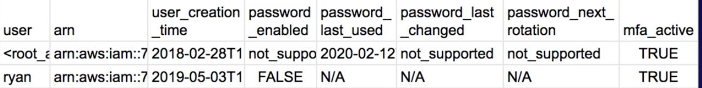

### Exam area
1. Incident Response -12%
- Trusted Advisor, CloudFormation, Service Catalog, VPC Flow Logs, AWS Config, API gateway, CloudTrail, CloudWatch.

2. Logging and Monitoring - 20%
- CloudWatch, Config, CloudTrail， Inspector， Kinesis.

3. Infrastructure Security -26%
- Route53, WAF, CloudFront, Shield,

4. IAM -20%

5. Data Protection -22%
- KMS, ACM, Secrets Manager,

### S3
- Glacier vault lock, vault lock policy, WORM(write once, read many times). Once locked, the policy can no longer be changed.
- VPC gateway endpoint-> DynamoDB and S3
- VPC interface endpoint -> other aws services.
- Object ACLs, give grants to bucket owner, grant access to individual objects.
- Bucket ACLS, grant log delivery group write permission to bucket.
- Bucket policies, offer larger permissions than bucket ACLs.
- S3 server-side encryption is used to protect data at rest.
### CloudFront
- Access logs for  source IP address, the original request, the referrer, and protocol information.
### STS
- Federation(typically Active Directory)
    - SAML
    - SSO allows users to log in without  IAM credentials
- Federation with Mobile Apps
    - Facebook/Amazon/Google or other OpenID providers to log in.
    - No need to store AWS credentials locally
    - Provide temporary credentials map to an IAM role
- Cross Account Access
- GetFederationToken returns a set of temporary security credentials (consisting of an access key ID, a secret access key, and a security token) for a federated user.
### Cognito
- Used for authenticating to web and mobile applications and is not related to Microsoft AD.
- User Pools, user directories
- Identity Pools, support **anonymous** guest users or unauthenticated access.
### IAM
- trust policy, a required resource-based policy that is attached to a role in IAM. The principles that you can specify in the trust policy include users, roles, accounts, and services.
- IAM Access Analyzer, helps you identify the resources in your organization and accounts, such as Amazon S3 buckets or IAM roles, **shared with an external entity**. This lets you identify unintended access to your resources and data.
- credential report, list all users and the status of their various credentials, passwords, access keys, MFA.

## Logging and Monitoring
### Cloudtrail
- log file integrity, delivered with a digest file.
- does not use an IAM Role it uses the service principal `“cloudtrail.amazonaws.com"`.
- Event history,-90days
### Cloud config
- detect  resources changes, not compromised access, not usage.
- Auto Remediation feature automatically remediates non-compliant resources evaluated by AWS Config rules.
- Provides a detailed list of resources defined in your aws account.
- Can add custom rules using Lambda functions.
- Trigger frequency is 1,3,6,12,24 hours.
### CloudHSM
- single tenancy, secure key store, cryptographic operations, tamper-resistant hardware security module
### AWS inspector
- CIS benchmarks/ certified rules, automated security, vulnerabilities assessment service
- tests the network accessibility of your **EC2** instances and the security state of your applications that run on those instances.
### Trust advisor
- provides recommendations that help you follow AWS best practices. Trusted Advisor evaluates your account by using checks. These checks identify ways to optimize your AWS infrastructure, improve security and performance, reduce costs, and monitor service quotas.
- can provide information on security groups for any sort of unrestricted access.
## Infrastructure security
### KMS
- key deletion time min 7 days
- Key rotation:
    - **AWS managed KMS, YOU CAN DO Nothing, even add key**, automatically rotates every year.
    - Customer Managed KMS, automatic rotation every 365 days(**disabled by default**), can rotate manually; create new CMK or change Key Alias to new CMK.
    - Customer managed + imported key material, no automatic rotation, create new CMK or change Key Alias to new CMK.
- **Kms:ViaService**, used for ec2/RDS from Us-west region
- **custom key store** is backed by AWS CloudHSM and imposes certain limitations. For example you **cannot import your own key material** into KMS keys or enable automatic rotation
- **cryptographic erasure**, is when the encryption material used to encrypt the data is deleted. ensure that the key materials are backed up offline(**import key material into an AWS KMS ke**y) so you can perform a restore of the data.

### System manager
- patch manager, can be used to scan systems, report compliance生成报告, identify vulnerable versions of software and then install the patches on the systems
- Automation runbooks
- systems Manager Compliance is used to scan instances for patch compliance and configuration inconsistencies. It is not used to monitor access policies of S3 buckets.
### Macie
- machine learning to discover, classify and protect **PII** in **S3/cloudtrail**
- Includes Dashboards, reports and alerting

### GuardDuty
- **threat detection service** provides an accurate and easy way to continuously monitor and protect AWS accounts and workloads.
- can detect attacks such as application-level attacks. However, to offer the protection you would need to integrate with other services such as CloudWatch Events and Lambda to respond to incidents.
- **Findings**, **Malicious and unauthorized behaviour**（resource affected, action )
### Security Hub
- central hub for security alerts
- automated checks
    - PCI-DSS(payment card industry)
    - CIS(center for internet security)
- Integration(guardduty, macie, inspector， firewall manager)

### Artifact
- central resource for compliance and security-related information

### DDos mitigation on AWS
- ELB, CloudWatch, ASG, Shield, Route53, WAF and CloudFront.

### AWS signer
- only trusted code runs in your Lambda functions, create digitally signed packages for Lambda deployment.

### VPC
- VPC **Traffic Mirroring,** use to copy network traffic from an elastic network interface of Amazon EC2 instances. You can then send the traffic to out-of-band security and monitoring appliances for: Content inspection, Threat monitoring and Troubleshooting
- Each EC2 instance performs **source/destination checks** by default. This means that the instance must be the source or destination of any traffic it sends or receives. However, an inline security appliance/a NAT instance must be able to send and receive traffic when the source or destination is not itself.
- The public keys are in the **.ssh/authorized_keys** file on the instance. To replace the key pair, generate a new key pair using the EC2 console and then paste the public key information into the **authorized_keys file**. The original key information should also be deleted.
### Organization trails
- **log events for the management account and all member accounts in the organization.**
- When you create an organization trail, a trail with the name that you give it will be created in every AWS account that belongs to your organization. Users with CloudTrail permissions in member accounts will be able to see this trail when they log into the AWS CloudTrail console from their AWS accounts, or when they run AWS CLI commands such as describe-trail.
- However, users in member accounts will not have sufficient permissions to delete the organization trail, turn logging on or off, change what types of events are logged
### Amazon Detective
- automatically collects log data from your AWS resources. It then uses machine learning, statistical analysis, and graph theory to generate visualizations that help you to conduct faster and more efficient security investigations.
- When you try to enable Detective, Detective checks whether GuardDuty has been enabled for your account for at least 48 hours. If you are not a GuardDuty customer or have been a GuardDuty customer for less than 48 hours, you cannot enable Detective. You must either enable GuardDuty or wait for 48 hours. This allows GuardDuty to assess the data volume that your account produces.
### OpenSearch
- successor to  Elasticsearch and is a distributed, open-source search and analytics suite used for a broad set of use cases like real-time application monitoring, log analytics, and website search. This service can receive data from Kinesis and can then analyze and store the data.
### *Secrets Manager vs Parameter Store*
- For Secrets Manager, PCI compliant where the mandate is to rotate your passwords every 90days. Only works for select databases and does not work for SSH keys
- For Parameter Store, a cheaper option to store encrypted or unencrypted secrets, does not automatically rotate credentials
### AWS Audit Manager
- map your compliance requirements to AWS usage data with prebuilt and custom frameworks and automated evidence collection.
### AWS Firewall Manager
- Works with WAF, Network Firewall, Shield, Route53 Resolver DNS Firewall.
- network access control list (NACL) is an optional layer of security for your **VPC or subnet level** that acts as a firewall for controlling traffic in and out of one or more subnets, while sg for instances.
### Kinesis
- Log ingestion
	- Kinesis data streams
	- Kinesis Data firehose
- Log analysis
	- Kinesis data analytics

### AWS Directory Service
- AWS Managed Microsoft AD - A Microsoft Active Directory is needed in the AWS Cloud.
- AD Connector - On-premises users need to access AWS services via AD.
- Simple AD - Low-scale, low-cost basic Active Directory capability.

### Others
- Direct Connect + Virtual private gateway(VGW)=encryption in transit( IPsec-encrypted private connection)
- Kinesis Data Streams uses TLS for all connections, so the data is encrypted in transit by default.
- **Forward Secrecy (FS)** uses a derived session key to provide additional safeguards against the eavesdropping of encrypted data. This prevents the decoding of captured data, even if the secret long-term key is compromised. **ALB does not support custom security policies.**

- Envelope encryption, encrypt plaintext data with a data key, and then encrypting the data key under another key.
- Key pairs consist of a public key and a private key. Private key to create digital signature, public to validate signature. Key pairs can be used to SSH to aws EC2 instances.
- AppSync enables subscriptions to synchronize data across devices.

Refer: https://learn.acloud.guru/course/aws-certified-security-specialty/dashboard