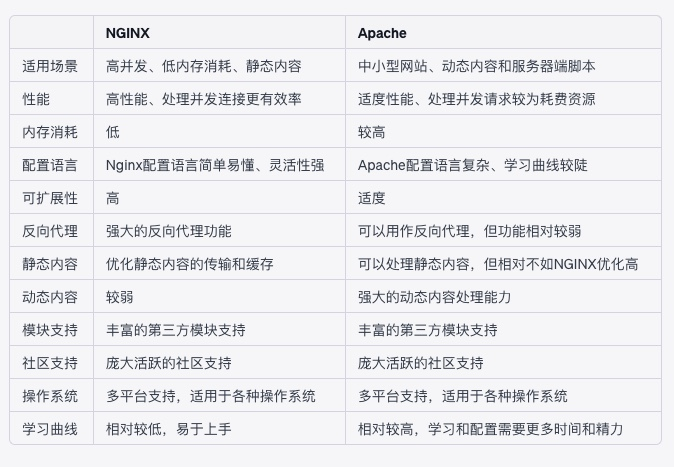

- Reverse Proxy Server
## NGINX vs Apache

## MacOS install Nginx
- `brew install nginx`
- `brew services reload nginx`
- Config file location `/usr/local/etc/nginx/nginx.conf`
- `curl -I ip/style.css` get header info
## Reverse Proxy
- 正向代理是客户端的代理，而反向代理是服务器的代理
- 正向代理（Forward Proxy）是一种代理服务器，代表客户端向其他服务器发送请求，并将响应返回给客户端
- 反向代理（Reverse Proxy）是一种网络服务，它代表服务器处理客户端请求，并将这些请求转发到内部网络中的后端服务器。

