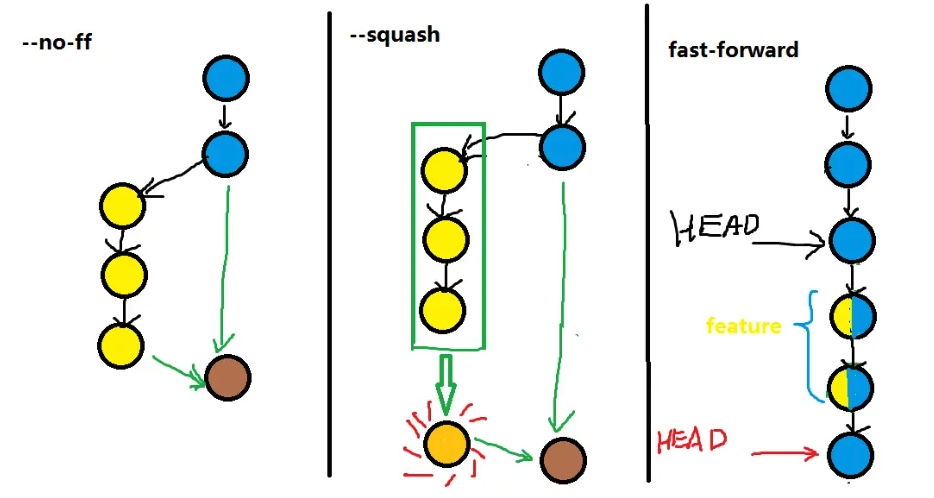

## English Version

1. `git clean` removes untracked files from the working tree. Use this command cautiously because it permanently deletes those files.
   - To see which files would be removed without actually deleting them, run: `git clean -n`
   - To remove untracked files, excluding directories, use: `git clean -f`
   - To also remove untracked directories, add the `-d` option: `git clean -fd`
2. `git gc` cleans up unnecessary files and optimizes the local repository. It does not affect the working tree or the project's current state.
3. `git reflog` shows a list of recent actions in the repository, including commits, amends, rebases, and more.
4. A Git fast-forward merge does not create a new commit.

   

   - If you prefer a merge commit for record-keeping, such as in certain team workflows, use the `--no-ff` option with `git merge`. This forces Git to create a new merge commit even when it could perform a fast-forward merge.
   - Reference: https://segmentfault.com/q/1010000002477106
5. `git push -f` (force push) forcefully updates the remote branch to the current state of your local branch. This can be dangerous because it rewrites remote history.
   - The command looks like this: `git push -f origin branch_name`.
6. `git remote remove` removes a remote reference from your local Git configuration. It does not affect commits or the remote repository itself.

---

## 中文版

1. `git clean` 用于从工作树中删除未跟踪的文件。使用此命令时务必谨慎，因为它会永久删除这些文件。
   - 如果要查看哪些文件会被删除，但不实际删除它们，可以运行：`git clean -n`
   - 如果要删除未跟踪的文件，但不包括目录，可以使用：`git clean -f`
   - 如果还要删除未跟踪的目录，请添加 `-d` 选项：`git clean -fd`
2. `git gc` 会清理不必要的文件并优化本地仓库。它不会影响工作树或项目的当前状态。
3. `git reflog` 会显示仓库中近期操作的列表，包括提交、修订提交、变基等。
4. Git 快进合并不会创建新的提交。

   

   - 如果出于记录目的希望保留合并提交，例如在某些团队工作流中，可以为 `git merge` 使用 `--no-ff` 选项。即使可以执行快进合并，这也会强制 Git 创建新的合并提交。
   - 参考资料：https://segmentfault.com/q/1010000002477106
5. `git push -f`（强制推送）会强制使用本地分支的当前状态更新远程分支。此操作可能很危险，因为它会重写远程历史。
   - 命令如下：`git push -f origin branch_name`。
6. `git remote remove` 用于从本地 Git 配置中删除远程引用。它不会影响提交或远程仓库本身。