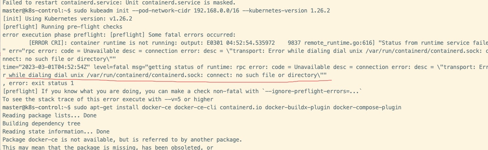

## English Version

### Install a Kubernetes cluster on Ubuntu

- Install three Ubuntu servers: one control-plane node and two worker nodes.
- Configure `/etc/hosts` and `/etc/hostname`.

```
cat << EOF | sudo tee /etc/modules-load.d/containerd.conf
overlay
br_netfilter
EOF

sudo modprobe overlay
sudo modprobe br_netfilter

```

```
cat <<EOF | sudo tee /etc/sysctl.d/99-kubernetes-cri.conf
net.bridge.bridge-nf-call-iptables  = 1
net.ipv4.ip_forward                 = 1
net.bridge.bridge-nf-call-ip6tables = 1
EOF

```

- Reload the system configuration:
  `sudo sysctl --system`
- Install containerd:
  `sudo apt-get update && sudo apt-get -y install containerd`
- Create a directory and configure containerd:

```
sudo mkdir -p /etc/containerd
sudo containerd config default | sudo tee /etc/containerd/config.toml
sudo systemctl restart containerd

sudo swapoff -a
sudo apt-get install -y apt-transport-https curl
curl -s https://packages.cloud.google.com/apt/doc/apt-key.gpg | sudo apt-key add -
```

- Configure the repository:
  `echo "deb https://apt.kubernetes.io/ kubernetes-xenial main" | sudo tee /etc/apt/sources.list.d/kubernetes.list`
- Update the APT package index, install kubelet, kubeadm, and kubectl, and prevent them from being updated automatically:

```
sudo apt-get update
sudo apt-get install -y kubelet kubeadm kubectl
sudo apt-mark hold kubelet kubeadm kubectl
```

```
sudo kubeadm init --pod-network-cidr 192.168.0.0/16 --kubernetes-version 1.26.2

  mkdir -p $HOME/.kube
  sudo cp -i /etc/kubernetes/admin.conf $HOME/.kube/config
  sudo chown $(id -u):$(id -g) $HOME/.kube/config
```

- Install the Calico network plugin:
  https://docs.tigera.io/calico/3.25/getting-started/kubernetes/self-managed-onprem/onpremises

- Generate the worker-node join command, then run its output on the worker nodes:
  `kubeadm token create --print-join-command`
- On the control-plane node, run `kubectl get nodes`.

### Error

1.  Install Docker: https://docs.docker.com/engine/install/ubuntu/
   Fix the error by following: https://forum.linuxfoundation.org/discussion/862825/kubeadm-init-error-cri-v1-runtime-api-is-not-implemented

---

## 中文版

### 在 Ubuntu 上安装 Kubernetes 集群

- 安装三台 Ubuntu 服务器：一台控制平面节点和两台工作节点。
- 配置 `/etc/hosts` 和 `/etc/hostname`。

```
cat << EOF | sudo tee /etc/modules-load.d/containerd.conf
overlay
br_netfilter
EOF

sudo modprobe overlay
sudo modprobe br_netfilter
```

```
cat <<EOF | sudo tee /etc/sysctl.d/99-kubernetes-cri.conf
net.bridge.bridge-nf-call-iptables  = 1
net.ipv4.ip_forward                 = 1
net.bridge.bridge-nf-call-ip6tables = 1
EOF

```

- 重新加载系统配置：
  `sudo sysctl --system`
- 安装 containerd：
  `sudo apt-get update && sudo apt-get -y install containerd`
- 创建目录并配置 containerd：

```
sudo mkdir -p /etc/containerd
sudo containerd config default | sudo tee /etc/containerd/config.toml
sudo systemctl restart containerd

sudo swapoff -a
sudo apt-get install -y apt-transport-https curl
curl -s https://packages.cloud.google.com/apt/doc/apt-key.gpg | sudo apt-key add -
```

- 配置软件仓库：
  `echo "deb https://apt.kubernetes.io/ kubernetes-xenial main" | sudo tee /etc/apt/sources.list.d/kubernetes.list`
- 更新 APT 软件包索引，安装 kubelet、kubeadm 和 kubectl，并阻止它们自动更新：

```
sudo apt-get update
sudo apt-get install -y kubelet kubeadm kubectl
sudo apt-mark hold kubelet kubeadm kubectl
```

```
sudo kubeadm init --pod-network-cidr 192.168.0.0/16 --kubernetes-version 1.26.2

  mkdir -p $HOME/.kube
  sudo cp -i /etc/kubernetes/admin.conf $HOME/.kube/config
  sudo chown $(id -u):$(id -g) $HOME/.kube/config
```

- 安装 Calico 网络插件：
  https://docs.tigera.io/calico/3.25/getting-started/kubernetes/self-managed-onprem/onpremises

- 生成工作节点的加入命令，然后在各工作节点上执行其输出：
  `kubeadm token create --print-join-command`
- 在控制平面节点上运行 `kubectl get nodes`。

### 错误

1.  安装 Docker：https://docs.docker.com/engine/install/ubuntu/
   按照以下说明修复错误：https://forum.linuxfoundation.org/discussion/862825/kubeadm-init-error-cri-v1-runtime-api-is-not-implemented
