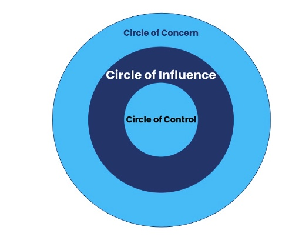
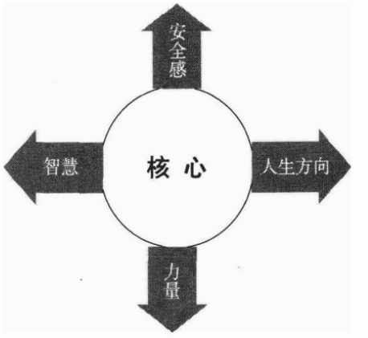
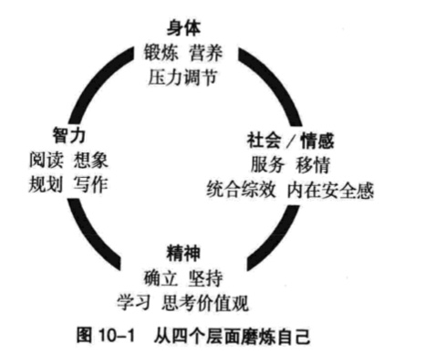

### Starting Point
- Fear and insecurity about life.
- A “get it now” mentality.
- Blaming other people.
- Despair and helplessness—a sense of having no power.
- A lack of direction in life.
- The desire for a meaningful, happy, peaceful, and effective life.

### 1. Be Proactive: Adopt a Growth Mindset
- `Take responsibility for your past, present, and future actions, and make decisions according to principles and values rather than emotions or external circumstances.`
- `Reactive people are unwilling to take responsibility for their choices. They see themselves as victims of their environment, their past, and other people.`
- Being proactive is not only an attitude toward action; it means taking responsibility for your life. Think “I can,” “I will,” and “I intend to,” rather than “if only,” “what if,” or “I cannot.”

- The circle of concern includes everything we pay attention to in daily life, such as health, family, career, the environment, current affairs, news, entertainment, and gossip.
- The circle of influence lies within the circle of concern and contains the things we can affect. At its core is our ability to make and keep commitments.
- For directly controllable problems, develop the right habits. For example, to maintain the ability to earn money, keep investing in yourself and improving your productive capacity.
- For indirectly controllable problems, work through your methods of influence.
- For uncontrollable problems, accept reality. If the weather cannot be changed, change your response to it.
- `Focus on things you can change and control`: make plans → keep learning → grow upward → expand the circle of influence → change from the inside out → become more fulfilled and creative → exert influence → change the environment.

### 2. Begin with the End in Mind
- Success can still leave a person feeling empty. Ask: What kind of person do you want to be? What gives life meaning?
- `For individuals, families, and organisations, first define a vision and goals, then shape the future accordingly.`

- Security represents values, identity, and a sense of emotional belonging.
- Guidance provides direction in life, principles for decisions, and internal standards.
- Wisdom provides insight, judgement, and understanding.
- Power is the ability to act and achieve goals.

### 3. Put First Things First
- `Order goals, vision, values, and priorities correctly.` Use self-discipline to keep important things first rather than being controlled by feelings, emotions, or impulses.
- `Focus on personal and professional development first, with less focus on entertainment.`
- Organise life and take action according to importance: this is both life management and time management.
- Identify roles → select goals → schedule progress → adjust daily.
- Stewardship delegation focuses on final results. Give people the freedom to choose how to do the work while holding them accountable for the result.
- Build the emotional bank account through courtesy, honesty, and trustworthiness.
- Understand other people and sincerely accept them.
- Keep promises and clarify expectations.
- Act with integrity and have the courage to apologise.

### 4. Think Win-Win
- `Seek mutual benefit based on mutual respect rather than hostile competition.`
- Practise integrity, an abundance mentality, and empathy.
- Maturity means being able to express your feelings and convictions while considering the thoughts and feelings of others.
- A win-win agreement covers desired results, guidelines, available resources, accountability, and consequences or rewards.

### 5. Seek First to Understand, Then to Be Understood
- Listen with both your ears and your heart, and seek genuine understanding.
- `Understand other people first, then seek to be understood.`

### 6. Synergise
- 1 + 1 > 2.
- Respect differences and use creative cooperation to find a third, better solution.

### 7. Sharpen the Saw

- Manage physical, spiritual, intellectual, and social-emotional resources to achieve your goals.
- Physical renewal includes healthy eating, adequate rest, and regular exercise.
- Spiritual and intellectual renewal includes:
  - Reading books, literary classics, and biographies to enrich cultural knowledge, broaden thinking, and improve the intellect.
  - Writing down thoughts, experiences, deep insights, and lessons learned so that thinking becomes clearer, more accurate, and more coherent.
- Social-emotional renewal includes interpersonal leadership, empathic communication, and creative cooperation.

#### References
- https://www.skillpacks.com/covey-circle-of-influence/

---

## 中文版

### 起点
- 对人生的恐惧感和不安全感。
- “现在就要得到”的心态。
- 抱怨他人。
- 绝望无助，感觉自己无能为力。
- 找不到人生定位。
- 希望拥有有意义、快乐、平和而高效的人生。

### 1. 积极主动：采用成长型思维
- `为自己过去、现在和未来的行为负责，并根据原则和价值观，而不是情绪或外在环境作出决定。`
- `消极被动的人不愿为自己的选择负责，总觉得自己是受害者，受到周围环境、过去和他人的拖累。`
- 积极主动不仅是一种行事态度，还意味着要对自己的人生负责。时刻想着“我可以”“我能”“我打算”，而不是“如果”“要是”或“我不能”。

- 关注圈包括我们日常关注的一切，例如健康、家庭、事业、环境、时事、新闻、娱乐和八卦。
- 影响圈位于关注圈之内，包含个人能力可以影响的事情。其核心是作出承诺并信守承诺的能力。
- 对于可以直接控制的问题，要培养正确的习惯。例如，要想一直拥有赚钱的能力，就要持续投资自己，保持并提高产能。
- 对于可以间接控制的问题，通过改善影响方式来处理。
- 对于无法控制的问题，要接受现实。例如，无法改变天气，就改变自己的应对方式。
- `专注于你能够改变和控制的事情`：制订计划 → 不断学习 → 向上成长 → 扩大影响圈 → 由内而外地改变 → 让自己更充实、更有创造力 → 施加影响 → 改变环境。

### 2. 以终为始
- 成功之后仍可能感到空虚。要问自己：你想成为什么样的人？什么能让生活充满意义？
- `无论个人、家庭还是组织，都应先拟定愿景和目标，再据此塑造未来。`

- 安全感代表价值观、认同和情感归属。
- 人生方向提供决策原则和内在标准。
- 智慧带来洞察力、判断力和理解力。
- 力量是采取行动并达成目标的能力。

### 3. 要事第一
- `正确安排目标、愿景、价值观和要事的先后顺序。` 靠自制力始终把重点放在第一位，避免被感觉、情绪或冲动左右。
- `优先关注个人和职业发展，少把注意力放在娱乐上。`
- 按照事务的重要程度安排生活并付诸行动，这既是人生管理，也是时间管理。
- 确认角色 → 选择目标 → 安排进度 → 每日调整。
- 责任型授权关注最终结果：让人们自由选择具体做法，同时对结果负责。
- 通过礼貌、诚实和守信积累情感账户。
- 理解他人，了解并真心接纳对方。
- 信守承诺，明确期望。
- 正直诚信，并勇于道歉。

### 4. 双赢思维
- `以相互尊重为基础寻求互惠，而不是敌对竞争。`
- 坚持诚信、富足心态和换位思考。
- 成熟意味着既能表达自己的情感和信念，也能体谅他人的想法与感受。
- 双赢协议包括预期结果、指导方针、可用资源、责任考核，以及后果或奖励。

### 5. 知彼解己：先理解别人，再争取被理解
- 用耳朵和内心倾听他人，真正理解对方。
- `先理解别人，再争取别人的理解。`

### 6. 统合综效
- 1 + 1 > 2。
- 尊重差异，通过创造性合作找到第三种、更好的解决方案。

### 7. 不断更新：磨利锯子

- 管理身体、精神、智力和社会情感资源，以实现目标。
- 身体层面的更新包括健康饮食、充足休息和定期锻炼。
- 精神和智力层面的更新包括：
  - 阅读书籍、文学名著和名人传记，丰富文化知识，拓展思维并提高智力。
  - 写下自己的想法、经历、深刻见解和学习心得，让思路变得更清晰、准确和连贯。
- 社会情感层面的更新包括人际领导、移情交流和创造性合作。

#### 参考资料
- https://www.skillpacks.com/covey-circle-of-influence/
