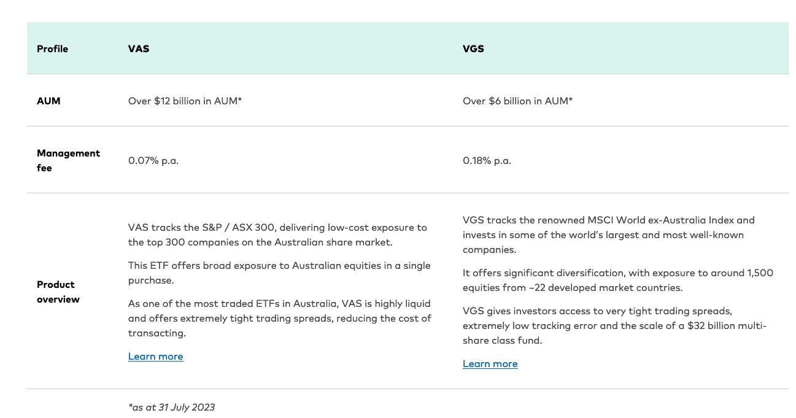

### 一些股票术语
- Ex-entitlement date就是权益调整生效的日期。在这一天之后，买入该股票的投资者将不再享有分红或其他权益。换句话说，如果你在这个日期之后购买股票，你将不再有资格获得即将发放的权益。
- Franking credits，当上市公司给股东分红的时候已经缴纳过公司所得税，股东收到股息后要以自己的边际税率（ marginal tax rate ）再交税
- Hedged ETF，对冲基金，投资海外资产的方式，同时降低了由于汇率波动而产生的风险。这种类型的ETF通常受到需要投资海外资产但希望减少外汇风险的投资者的青睐。

### 买基金注意事项
- 基金公司规模和要买的基金的规模
- 基金每年的管理费
- 跟踪指数 and top10 holdings
- 5年和10年的表现和回报
- 汇率波动是否影响
- 破除本地偏好，投资全球市场，分散分险

### VAS
- track S&P/ASX 300 Index，澳洲市场
- 主要top10的公司有哪些，投资在银行和能源
- 近几年的回报率 Performance
- Distribution History，看近几年的分红和多久分一次红（半年，3个月？）

### VGS
-  tracks the renowned MSCI World ex-Australia Index and invests in some of the world’s largest and most well-known companies.
- MSCI World ex-Australia指数是一个由摩根士丹利资本国际(MSCI)编制的股票指数，它跟踪全球除澳大利亚以外的发达国家的股票市场表现。

本国偏好，依赖于当地经济。

 
From link https://www.vanguard.com.au/adviser/learn/vas-and-vgs

### VGAD
- Vanguard MSCI Index International Shares (Hedged) ETF (VGAD),是VGS的hedge版本。
- 这个基金不会受到由于货币汇率的波动，而导致对价格的影响。
- VGAD vs VGS
  - 澳元汇率上涨会对VGS指数的表现产生负面影响.
  - 如果要在VGS 或 VGAD之间二选一的话，如果当时澳元处于低位，就应该投VGAD，反过来如果澳元在高位，就应该投VGS。Refer: https://sydneyuberer.com/vgad-vanguard-hedged-etf-vgad-vs-vgs/

### S&P500（标普500强）
- 长期投资，10年以上持有。
- capitalization-weighted index, 市值更大的公司所占的权重更大.
- 一直在更新，长期能跑赢大盘。
- Vanguard S&P 500 ETF，- VOO
- `IVV` – iShares S&P 500 ETF
- `SPY`
- 股市不是线性增长的，长期赚钱，短期波动大。

### VGE 新兴市场ETF
- Vanguard FTSE Emerging Markets Shares ETF AUD
- 新兴市场基金的投资对象通常包括发展中国家和地区，如中国、印度、巴西、俄罗斯、南非、墨西哥等。这些国家具有较高的经济增长潜力和市场活力，但同时也伴随着较高的风险和波动性。

### VTS

### VDHG - FOF(Fund of Funds)
- Diversified，跟踪各种混合ETF
- 简单高效，回报是全球市场的平均，不太适合追求高风险和高回报人群
- 风险分散，自动资产平衡-低买高卖
- VS DHHF（betashares公司）,  all-in-one investment solution, with a 100% allocation to shares

